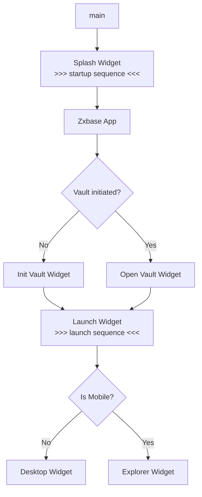

# Diagrams

## Launch

```mermaid
  graph TD;
      A[main] --> A1["Splash Widget <br/> >>> startup sequence <<<"];
      A1 --> A2[Zxbase App];
      A2 --> B{Vault initiated?};
      B -- No --> C;
      B -- Yes --> D;
      C[Init Vault Widget] --> E;
      D[Open Vault Widget] --> E["Launch Widget <br/> >>> launch sequence <<<"];
      E --> F{Is Mobile?};
      F -- No --> G[Desktop Widget];
      F -- Yes --> H[Explorer Widget];
```
